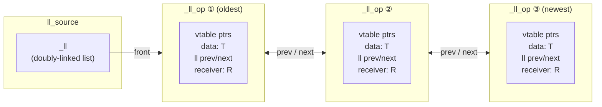
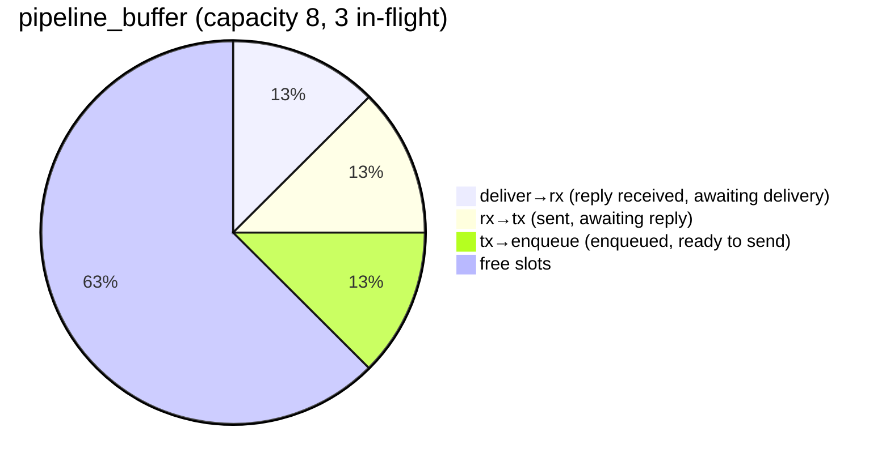

<div align="center">

# ecor

**Embedded Coroutines & Execution**

[**Documentation**](https://koniarik.github.io/ecor/)

---

Single-header C++20 coroutine and async execution library for embedded systems

</div>

C++ has `std::execution` (P2300) for async operations, contains part of the implementation to
provide additional embedded friendly abstractions. We need something lightweight,
zero-allocation capable, and usable in resource-constrained systems.

`ecor` is a **single-header** implementation of P2300 sender/receiver model with coroutine
support, designed specifically for embedded systems. It provides zero-allocation async
primitives, custom memory management, and additional abstractions missing from the standard.

## Quick Start

```cpp

// Async task using coroutines
ecor::task<int> fetch_data(ecor::task_ctx& ctx)
{
    // Your async work here
    co_return 42;
}

// A receiver to handle task completion
struct my_receiver {
    int& result_ref;

    // Receiver concept requires this tag
    using receiver_concept = ecor::receiver_t;

    // Called when task completes successfully
    void set_value(int value) noexcept {
        result_ref = value;
    }

    // Called on error (required by receiver concept)
    template<typename E>
    void set_error(E&&) noexcept {
        // Handle error
    }

    // Called on cancellation (required by receiver concept)
    void set_stopped() noexcept {
        // Handle cancellation
    }

    // Receiver environment (required by receiver concept)
    auto get_env() const noexcept {
        return ecor::empty_env{};
    }
};

int my_main()
{
    // Set up memory for tasks
    uint8_t buffer[4096];
    ecor::circular_buffer_memory<uint16_t> mem{std::span{buffer}};
    ecor::task_ctx ctx{mem};

    // Create task - this returns a sender
    auto task_sender = fetch_data(ctx);

    // A task doesn't run until we connect and start it
    int result = 0;

    // Connect sender to receiver, creating an operation state
    auto op = std::move(task_sender).connect(my_receiver{result});

    // Start the operation - this begins execution
    op.start();

    // Run the task core until operation completes
    // The task is scheduled on the core after start()
    while (ctx.core.run_once()) { }

    // result now contains 42
    return 0;
}
```

## Tasks - Coroutine-based Async

Tasks are the **primary way** to write async code in ecor. They're coroutines that can
`co_await` other async operations.

### Basic Task

```cpp
#include <ecor/ecor.hpp>

ecor::task<void> simple_task(ecor::task_ctx& ctx)
{
    // Task automatically runs on the task_core scheduler
    co_return;
}

ecor::task<int> compute_value(ecor::task_ctx& ctx)
{
    // Do some work
    int result = 42;
    co_return result;
}
```

### The Context Argument

Every task coroutine **must** take a value satisfying `ecor::task_context` as its **first
argument**. `ecor::task_ctx` is the built-in type that satisfies this concept. The context
carries the scheduler (`task_core`) and the memory resource used to allocate the coroutine
frame.

Because the first argument is special and resolved at coroutine instantiation time, **lambda
functions cannot be tasks**.

> For how to implement a custom context type, see [Custom Task Context](#custom-task-context).

### Awaiting Other Tasks

```cpp
ecor::task<int> get_sensor_value(ecor::task_ctx& ctx)
{
    // Simulate reading sensor
    co_return 100;
}

ecor::task<void> process_sensor(ecor::task_ctx& ctx)
{
    // Await another task
    int value = co_await get_sensor_value(ctx);

    // Process the value
    if (value > 50) {
        // Handle high value
    }

    co_return;
}
```

### Awaiting Senders

Tasks can await any sender (P2300 concept):

```cpp
ecor::task<void> wait_for_event(
    ecor::task_ctx& ctx,
    ecor::ll_source<ecor::unit, ecor::set_value_t(int)>& events)
{
    // Await an event from an ll_source
    int value = co_await events.schedule();

    // Continue after event received
    co_return;
}
```

### Cooperative Scheduling — `ecor::suspend`

Use `co_await ecor::suspend;` to yield from the current task, placing it at the back of the
ready queue so other tasks get a chance to run first.

```cpp
ecor::task<void> worker_a(ecor::task_ctx& ctx)
{
    while (true) {
        toggle_led();

        // Yield: let other ready tasks run before resuming
        co_await ecor::suspend;
    }
}
```

If a stop has already been requested at the point of suspension, the task completes with
`set_stopped()` instead of resuming — no callbacks or extra allocations involved.

## Event Sources — `ll_source`

`ll_source<T, S...>` is the core event source primitive in ecor. It maintains a doubly-linked
list of pending scheduled operations — each one is an async receiver waiting for an event.
The first template parameter `T` is a payload type embedded in each node by the caller of
`schedule(T x)` — the same side that creates the sender and attaches the receiver. This lets the
driver read per-request data from `entry->data` via `query_next()` without knowing the
receiver type. `unit` is used when there is no payload. The remaining parameters `S...` are
completion signatures (`set_value_t(...)`, `set_error_t(...)`, `set_stopped_t()`,
`get_stopped_t()`).

How entries are dispatched is up to the driver:
- **`src.query_next()`** — returns the oldest waiting entry for the driver to complete
  individually, enabling FIFO, priority, or any other policy.
- **`ecor::broadcast(src, fn)`** — calls `fn` on every waiting entry, delivering the
  event to all at once.

Each `schedule()` + `connect()` + `start()` call creates an `_ll_op` on the caller's stack
(or in a coroutine frame), linked into the source's doubly-linked list:



### Point-to-Point — FIFO Delivery

`src.query_next()` removes and returns the oldest waiting entry. The driver then calls
`set_value()`, `set_error()`, or `set_stopped()` on it, waking exactly that one task. If
no tasks are waiting, `query_next()` returns `nullptr` and the event is dropped.

```cpp
#include <ecor/ecor.hpp>

using job_queue = ecor::ll_source<ecor::unit, ecor::set_value_t(int)>;

ecor::task<void> worker_task(ecor::task_ctx& ctx, int worker_id, job_queue& q)
{
    while (true) {
        int job_id = co_await q.schedule();
        // Only ONE worker receives this specific job_id
    }
}

ecor::task<void> producer_task(ecor::task_ctx& ctx, job_queue& q)
{
    if (auto* e = q.query_next()) e->set_value(101); // Wakes the first waiting worker
    if (auto* e = q.query_next()) e->set_value(102); // Wakes the second waiting worker
    co_return;
}
```

### Broadcast — One-to-Many Events

`ecor::broadcast(src, fn)` calls `fn` on every entry currently waiting in `src`, delivering
the event to all subscribers at once. If no tasks are waiting, the event is dropped. Each
task must re-register with `schedule()` to receive future events.

```cpp
#include <ecor/ecor.hpp>

using button_event = ecor::ll_source<ecor::unit, ecor::set_value_t(int)>;

ecor::task<void> button_handler(ecor::task_ctx& ctx, button_event& btn)
{
    while (true) {
        int button_id = co_await btn.schedule();
        // All subscribed tasks receive this event
    }
}

ecor::task<void> led_controller(ecor::task_ctx& ctx, button_event& btn)
{
    while (true) {
        int button_id = co_await btn.schedule();
        // Update LEDs based on button
    }
}

ecor::task<void> system_task(ecor::task_ctx& ctx, button_event& btn)
{
    // Button 1 pressed — both handlers receive this
    ecor::broadcast(btn, [](auto& entry) { entry.set_value(1); });
    co_return;
}
```

### Request-Reply Protocol

The payload `T` makes `ll_source` a natural fit for request-reply protocols (UART, SPI,
I²C, …). The caller embeds per-request data in the node via `schedule(T{...})`; the driver
reads it from `entry->data` and completes the entry when the reply arrives:

```cpp
struct uart_request { uint8_t cmd; };

using uart_source = ecor::ll_source<
    uart_request,
    ecor::set_value_t(uint8_t)  // reply byte
>;

ecor::task<void> send_command(ecor::task_ctx& ctx, uart_source& uart)
{
    uint8_t reply = co_await uart.schedule(uart_request{.cmd = 0x42});
    // reply contains the byte sent back by the device
}

// Called from the main loop / ISR:
void uart_tick(uart_source& uart)
{
    auto* entry = uart.query_next();
    if (!entry) return;

    start_uart_tx(entry->data.cmd);   // use per-request data
    uint8_t resp = wait_for_uart_rx();
    entry->set_value(resp);
}
```

### Multiple Value Types

Sources can handle multiple value completion signatures:

```cpp
using sensor_events = ecor::ll_source<
    ecor::unit,
    ecor::set_value_t(int),    // Temperature reading
    ecor::set_value_t(float)   // Humidity reading
>;

ecor::task<void> sensor_monitor(ecor::task_ctx& ctx, sensor_events& events)
{
    auto sender = events.schedule();

    // Sender will complete with one of the value signatures
    // as_variant converts multiple set_value signatures into std::variant
    auto result = co_await (sender | ecor::as_variant);

    // Handle different value types
    std::visit([](auto&& val) {
        if constexpr (std::is_same_v<std::decay_t<decltype(val)>, int>) {
            // Process temperature (int)
        } else {
            // Process humidity (float)
        }
    }, result);

    co_return;
}
```

### Custom error types

Sources can also have custom error signatures:

```cpp
using error_events = ecor::ll_source<
    ecor::unit,
    ecor::set_value_t(int),
    ecor::set_error_t(std::string)  // Custom error type
>;
```

This allows you to send error events to all waiting tasks which can be useful for broadcasting
system-wide errors or status updates. However, this is not compatible with the standard
configuration of `ecor::task` which expects only `set_error_t(ecor::task_error)` — a source
with any extra error signature can't be directly awaited. Use one of the sender combinators
to handle this, e.g., `sink_err` to convert errors into optional.

### Stoppable signature

You can also add a stoppable signature to allow waiting tasks to be cancelled:

```cpp
using stoppable_events = ecor::ll_source<
    ecor::unit,
    ecor::set_value_t(int),
    ecor::set_stopped_t()  // Stoppable signature
>;
```

Adding `ecor::get_stopped_t()` to the signature list enables automatic stop-polling in
`query_next()`: consecutive stopped entries are drained from the front — each front entry
whose stop token is triggered is completed with `set_stopped()` and removed, until the front
entry is live or the queue is empty. Only entries that surface at the front are examined;
entries deeper in the list are not touched until they reach the front. Omit `get_stopped_t()`
when cancellation is handled entirely by the driver.

### Descriptor Types

A *descriptor* is a payload type that also declares its own completion signatures as a
nested `completion_signatures` type alias. Any type satisfying this shape meets the
`event_descriptor` concept and can be passed as the **sole** template argument to
`ll_source<D>` or `seq_source<K, D>`:

```cpp
struct uart_transaction {
    uint8_t cmd;

    // Completion signatures live on the payload type itself
    using completion_signatures = ecor::completion_signatures<
        ecor::set_value_t(uint8_t),   // reply byte on success
        ecor::set_error_t(uint8_t),   // hardware error code
        ecor::set_stopped_t(),        // cancellation
        ecor::get_stopped_t()         // enable stop-polling in query_next()
    >;
};

// Descriptor form — signatures inferred from uart_transaction::completion_signatures
using uart_desc = ecor::ll_source<uart_transaction>;

// Explicit-sig form — same behaviour, just written out inline
using uart_explicit = ecor::ll_source<
    uart_transaction,
    ecor::set_value_t(uint8_t),
    ecor::set_error_t(uint8_t),
    ecor::set_stopped_t(),
    ecor::get_stopped_t()
>;

// Override: if explicit S... are given, descriptor's sigs are ignored entirely
using uart_reply_only = ecor::ll_source<
    uart_transaction,
    ecor::set_value_t(uint8_t)   // only this signature; rest of descriptor's sigs discarded
>;
```

Both `uart_desc` and `uart_explicit` produce identical behaviour. The descriptor form
co-locates signatures with the payload type, reducing duplication when the same transaction
type is reused across multiple sources.

#### `get_stopped_t()` and stop-polling

`get_stopped_t()` may appear in a descriptor's `completion_signatures` to enable automatic
stop-polling. It is **never** part of the public sender `completion_signatures` exposed to
coroutines — it is stripped before the sender type is presented to `co_await`.

The behaviour is identical across both source types, with one important constraint:

| Source | `get_stopped_t()` present | Effect on `query_next()` |
|--------|---------------------------|---------------------------|
| `ll_source<D>` | yes | drains consecutive stopped **front** entries (cancel each), returns first live entry or `nullptr` if empty |
| `seq_source<K, D>` | yes | drains consecutive stopped **top** (min-key) entries (cancel each), returns first live entry or `nullptr` if empty |

> **Front-draining semantics:** `query_next()` drains stopped entries from the front/top
> in a loop — cancelling each one until a live entry is found or the source is empty. Entries
> deeper in the queue/heap are not examined until they surface at the front.

```cpp
struct timed_event {
    int event_id;
    using completion_signatures = ecor::completion_signatures<
        ecor::set_value_t(uint64_t),
        ecor::get_stopped_t()   // stop-poll active; drains stopped entries from the front/top
    >;
};

ecor::ll_source<timed_event>            ll;  // front entry checked on each query_next()
ecor::seq_source<uint64_t, timed_event> sq;  // top (min-key) entry checked on each query_next()
```

### ISR Pipeline — `pipeline_buffer`

`pipeline_buffer` is a 4-cursor ring buffer for managing `ll_source` entries that cross an
ISR boundary. Once an entry is dequeued from an `ll_source` via `query_next()`, it can be
placed in a `pipeline_buffer` to track it through the stages of a hardware pipeline:
**enqueue → tx → rx → deliver**. The cursors use `std::atomic` for safe cross-context
access between the main loop and ISRs.

```cpp
struct buf_trnx {
    int request_id;
};

void buffer_example() {
    using entry_t = ecor::ll_entry<
        buf_trnx,
        ecor::set_value_t(int),
        ecor::set_error_t(uint8_t),
        ecor::set_stopped_t(),
        ecor::get_stopped_t()>;

    ecor::ll_source<
        buf_trnx,
        ecor::set_value_t(int),
        ecor::set_error_t(uint8_t),
        ecor::set_stopped_t(),
        ecor::get_stopped_t()> source;
    ecor::pipeline_buffer<entry_t*, 4> buffer;

    // Driver tick loop:
    // 1. Move pending entries into the buffer
    while (!buffer.full()) {
        auto* entry = source.query_next();
        if (!entry) break;
        buffer.push(entry);
    }

    // 2. Start TX for queued entries
    while (buffer.has_tx()) {
        // Start hardware transmission for buffer.tx_front()
        buffer.tx_done();
    }

    // 3. ISR marks RX complete
    // buffer.rx_done();

    // 4. Deliver completions back to receivers
    while (buffer.has_deliver()) {
        auto* entry = buffer.deliver_front();
        entry->set_value(0);  // complete with reply
        buffer.pop();
    }
}
```

Once an entry is taken from the source's linked list and placed in a `pipeline_buffer`, the
buffer's four atomic cursors partition in-flight entries into pipeline stages:



> **ISR safety:** `pipeline_buffer` uses `std::atomic` cursors. On single-word architectures
> (e.g. ARM Cortex-M), these compile to plain loads/stores with no overhead. Stop tokens
> are only checked while an entry is still in the `ll_source` linked list; once it is moved
> into a `pipeline_buffer`, the driver is fully responsible for completing it.

## Sequential Source - Ordered Event Processing

`seq_source` provides **ordered, keyed event processing**. Events with keys are processed in
order of the keys.

```cpp
using seq_source = ecor::seq_source<
    uint64_t,  // Key: timestamp or priority
    ecor::unit,
    ecor::set_value_t(int)  // Value: event payload
>;
```

### Timer Implementation Example

```cpp
#include <ecor/ecor.hpp>

// Timer event: key is wake-up time, value is task ID
using timer_source = ecor::seq_source<
    uint64_t,  // Key: timestamp when to wake
    ecor::unit,
    ecor::set_value_t(uint64_t)  // Value: timestamp when timer fired
>;

class timer_manager {
public:
    timer_manager() = default;

    // Register a timer to fire at specific time
    auto sleep_until(uint64_t wake_time) {
        // Wait for timer event with this timestamp
        // Events are processed in key order (earliest first)
        return source.schedule(wake_time);
    }

    // Called periodically from main loop
    void tick(uint64_t current_time) {
        // Fire all timers that are due (min-key entry first)
        while (!source.empty() && source.front().key <= current_time) {
            auto* entry = source.query_next();
            entry->set_value(entry->key);
        }
    }

private:
    timer_source source;
};

// Usage example
ecor::task<void> blink_led(ecor::task_ctx& ctx, timer_manager& timer) {
    while (true) {
        uint64_t now = get_current_time();

        // Sleep for 1000ms
        co_await timer.sleep_until(now + 1000);

        toggle_led();
    }
}

ecor::task<void> read_sensor(ecor::task_ctx& ctx, timer_manager& timer) {
    while (true) {
        uint64_t now = get_current_time();

        // Sleep for 5000ms
        co_await timer.sleep_until(now + 5000);

        read_temperature_sensor();
    }
}

// Multiple tasks can sleep simultaneously with different wake times
// The seq_source ensures they wake in the correct order
```

### Priority Queue Pattern

`seq_source` can implement priority-based message delivery where messages go to the highest
priority (lowest key) waiter:

```cpp
using priority_queue = ecor::seq_source<
    uint32_t,  // Priority (lower = higher priority)
    ecor::unit,  // No per-entry payload
    ecor::set_value_t(std::string)  // Message payload
>;

ecor::task<void> high_priority_handler(
    ecor::task_ctx& ctx,
    priority_queue& queue)
{
    while (true) {
        // Register with priority 0 (highest)
        std::string msg = co_await queue.schedule(0);
        // This task gets messages first
        process_message(msg);
    }
}

ecor::task<void> low_priority_handler(
    ecor::task_ctx& ctx,
    priority_queue& queue)
{
    while (true) {
        // Register with priority 10 (lower)
        std::string msg = co_await queue.schedule(10);
        // This task only gets messages if no high-priority tasks are waiting
        process_message(msg);
    }
}

ecor::task<void> producer(ecor::task_ctx& ctx, priority_queue& queue) {
    // Send a message — it goes to the task with lowest priority key (highest priority)
    if (auto* e = queue.query_next()) e->set_value("urgent message");
    co_return;
}
```

## Stop Tokens - Cancellation

ecor implements `inplace_stop_token` and `inplace_stop_source` from P2300, providing
cooperative cancellation without allocation.

### Basic Cancellation

```cpp
#include <ecor/ecor.hpp>

ecor::inplace_stop_source stop_source;

ecor::task<void> long_running_task(ecor::task_ctx& ctx) {
    auto token = stop_source.get_token();

    for (int i = 0; i < 1000000; ++i) {
        // Check for cancellation
        if (token.stop_requested()) {
            // Clean up and exit
            co_return;
        }

        // Do work...
    }

    co_return;
}

// From another context (e.g., button press)
void cancel_operation() {
    stop_source.request_stop();
}
```

### Stop Callbacks

Register callbacks to be invoked when stop is requested:

```cpp
void example() {
    ecor::inplace_stop_source source;
    auto token = source.get_token();

    // Callback invoked when stop is requested
    ecor::inplace_stop_callback cb{token, []() {
        // Cleanup, close handles, cancel I/O, etc.
        cleanup_resources();
    }};

    // Later...
    source.request_stop();  // Callback executed here
}
```

### Multiple Callbacks

```cpp
void example() {
    ecor::inplace_stop_source source;

    // Multiple callbacks, all invoked on stop
    ecor::inplace_stop_callback cb1{source.get_token(), []() { close_file(); }};
    ecor::inplace_stop_callback cb2{source.get_token(), []() { disable_interrupt(); }};
    ecor::inplace_stop_callback cb3{source.get_token(), []() { flush_buffers(); }};

    source.request_stop();  // All callbacks execute
}
```

### Callback During Stop

If you register a callback after stop has been requested, it executes immediately:

```cpp
void example() {
    ecor::inplace_stop_source source;
    source.request_stop();  // Stop already requested

    // Callback executes immediately in constructor
    ecor::inplace_stop_callback cb{source.get_token(), []() {
        // This runs right now!
    }};
}
```

### Stop Token from Receiver Environment

The canonical way to obtain a stop token inside a sender or operation state is to query the
receiver's environment. This lets the stop signal propagate automatically from whoever drives
the receiver — for example, the enclosing `task` — without the sender needing to know who
created the stop source:

```cpp
struct my_receiver {
    using receiver_concept = ecor::receiver_t;
    ecor::inplace_stop_source& stop_src;

    void set_value() noexcept {}
    template<typename E> void set_error(E&&) noexcept {}
    void set_stopped() noexcept {}

    // Environment carries the stop token so senders can register callbacks
    auto get_env() const noexcept {
        return ecor::stop_token_env{ stop_src.get_token() };
    }
};

struct my_op {
    my_receiver recv;
    std::optional<ecor::inplace_stop_callback<std::function<void()>>> stop_cb;

    void start() {
        // Pull the token out of the receiver's environment
        auto token = ecor::get_stop_token(ecor::get_env(recv));

        // Register a callback: when the caller cancels, abort the operation
        stop_cb.emplace(token, [this]() { abort_hardware(); });

        begin_hardware_operation();
    }

    void abort_hardware() { /* cancel in-flight I/O */ }
    void begin_hardware_operation() { /* start I/O */ }
};
```

When writing a custom sender, query the token in `start()` after the receiver is in place.
This is the pattern used throughout ecor's own op-state types.

## Memory Management

ecor provides deterministic memory management for embedded systems through custom allocators.

### Circular Buffer Memory

Pre-allocate a buffer for all async operations:

```cpp
#include <ecor/ecor.hpp>

// Static buffer for task allocation
uint8_t task_buffer[8192];

// Create memory manager
ecor::circular_buffer_memory<uint16_t> mem{std::span{task_buffer}};

// Create task context with this memory
ecor::task_ctx ctx{mem};

// All tasks using this context allocate from the buffer
auto t1 = my_task(ctx);
auto t2 = another_task(ctx);

// No heap allocation, deterministic memory usage
```

### Custom Memory Resources

Implement your own memory resource:

```cpp
struct my_memory_resource {
    void* allocate(std::size_t bytes, std::size_t align) {
        // Your allocation logic
        return custom_alloc(bytes, align);
    }

    void deallocate(void* p, std::size_t bytes, std::size_t align) {
        // Your deallocation logic
        custom_free(p, bytes, align);
    }
};

my_memory_resource my_mem;
ecor::task_memory_resource mem_resource{my_mem};
// Use mem_resource with task_ctx
```

### Checking Memory Usage

```cpp
void check_memory() {
    uint8_t buffer[4096];
    ecor::circular_buffer_memory<uint16_t> mem{std::span{buffer}};

    std::size_t capacity = mem.capacity();      // Total buffer size
    std::size_t used = mem.used_bytes();        // Currently used
    std::size_t available = capacity - used;    // Available space

    // Monitor memory usage for debugging
    if (used > capacity * 0.9) {
        // Warn: running low on memory
    }
}
```

## Sender Combinators

ecor provides P2300-style sender combinators for composing async operations.

### or - Race Multiple Senders

Passess calls to the first sender that completes (value, error, or stopped), other is ignored.

```cpp
ecor::task<void> example(ecor::task_ctx& ctx, auto sender1, auto sender2) {
    // Race two async operations
    auto winner = co_await (sender1 || sender2);
    // Completes with whichever finishes first
    co_return;
}
```

### as_variant - Handle Multiple Completions

If a sender has multiple `set_value` signatures, `as_variant` converts them into a single
`std::variant` - combining multiple value types into one.

```cpp
ecor::task<void> example(ecor::task_ctx& ctx) {
    ecor::ll_source<
        ecor::unit,
        ecor::set_value_t(int),
        ecor::set_value_t(float)
    > source;

    auto result = co_await (source.schedule() | ecor::as_variant);

    std::visit([](auto val) {
        if constexpr (std::is_same_v<decltype(val), int>) {
            // Handle int
        } else {
            // Handle float
        }
    }, result);
    co_return;
}
```

### sink_err - Convert Errors to Optional

For void-returning senders that might error, `sink_err` converts errors into an optional:

```cpp
ecor::task<void> example_sink(ecor::task_ctx& ctx) {
    // sink_err converts errors into std::optional<std::variant<error_types...>>
    // For void senders, the result contains the error if one occurred
    auto result = co_await (my_task(ctx) | ecor::sink_err);

    // Result is optional - CONTAINS the error if one occurred, empty if succeeded
    if (result) {
        // Operation FAILED - result contains the error variant
        std::visit([](auto&& error) {
            // Handle the error
        }, *result);
    } else {
        // Operation succeeded (no error)
    }
    co_return;
}
```

### then - Transform Values

`then` applies a callable to each `set_value` completion, passing errors and stop signals
through unchanged:

```cpp
ecor::task<void> example(ecor::task_ctx& ctx) {
    ecor::ll_source<ecor::unit, ecor::set_value_t(int)> source;

    // Double every value; errors/stopped pass through as-is
    int result = co_await (source.schedule() | ecor::then([](int v) { return v * 2; }));
    co_return;
}
```

If the callable returns `void`, the output sender emits `set_value_t()`.

## Custom Senders

Writing a sender from scratch requires a `sender` struct, an op-state struct, and a `connect`
method — boilerplate that grows quickly. `sender_from<T>` is an alternative: provide a payload
type `T` with a `completion_signatures` typedef and a `start(op&)` method, and the library
handles the rest.

This is the natural way to integrate external event sources (hardware peripherals, OS APIs,
third-party callbacks) into the sender/receiver model.

```cpp
struct async_c_ctx { /*...*/ };

int some_async_c_api(
    struct async_c_ctx* ctx,
    void (*callback)(int result, void* user_data),
    void* user_data){
        /*...*/
        return 42;
    }

struct some_async_payload {
    using completion_signatures =
        ecor::completion_signatures< ecor::set_value_t(), ecor::set_error_t(int) >;

    async_c_ctx* c_ctx;

    void start(auto& op) {
        // &op is stable until set_value/set_error is called.
        int res = some_async_c_api(c_ctx, [](int result, void* user_data) {
            using op_t = std::remove_reference_t<decltype(op)>;
            auto& op = *static_cast<op_t*>(user_data);
            if (result >= 0)
                op.receiver.set_value();
            else
                op.receiver.set_error(result);
        }, &op);
        if (res < 0)
            op.receiver.set_error(res);  // immediate error
    }
};

using some_async_sender = ecor::sender_from<some_async_payload>;

// `some_async_payload` wraps a C callback API: `start()` registers the callback and passes
// `&op` as user data so the callback can signal the receiver when the operation completes.
// The alias `some_async_sender` gives the type a stable name for use at call sites.
// `sink_err` converts the `set_error_t(int)` completion into an optional so the task
// doesn't need a custom error configuration.
ecor::task<void> use_async_api(ecor::task_ctx& ctx, async_c_ctx& c_ctx) {
    co_await (some_async_sender{ { .c_ctx = &c_ctx } } | ecor::sink_err);
}
```


## Task Holder - Automatic Restart

`task_holder` owns a `task<void, CFG>` and restarts it automatically every time it completes,
providing a simple "never-stop service" abstraction with cooperative cancellation.

```cpp
ecor::ll_source<ecor::unit, ecor::set_value_t()> some_event;

ecor::task<void> my_service(ecor::task_ctx& ctx)
{
    // Do one unit of work, then return — task_holder will restart us
    co_await some_event.schedule();
    co_return;
}

void run()
{
    static uint8_t buffer[4096];
    ecor::circular_buffer_memory<uint16_t> mem{std::span{buffer}};
    ecor::task_ctx ctx{mem};

    // CTAD deduces template parameters from ctx and the lambda
    ecor::task_holder holder{ ctx, [](ecor::task_ctx& c) {
        return my_service(c);
    }};

    holder.start();   // schedules first run on the next task_core tick

    // ... event loop ...
    while (ctx.core.run_once()) { }
}
```

### Restart policy

- Restarts on **any completion** (`set_value`, `set_error`, or `set_stopped` from the inner task).
- Exits the loop only when `stop()` has been called **and** the next completion arrives —
  regardless of which signal that is.
- Exceptions thrown inside the task are converted to
  `set_error(task_error::task_unhandled_exception)` and also trigger a restart.

### Stopping

`stop()` signals the holder to exit after the current task completes. It returns a sender that
fires once the loop has exited — safe to `co_await` from another task:

```cpp
ecor::ll_source<ecor::unit, ecor::set_value_t()> shutdown_src;

ecor::task<void> watchdog(ecor::task_ctx& ctx, ecor::_task_holder_base<>& holder)
{
    co_await shutdown_src.schedule();

    // Signal stop and wait for the loop to exit cleanly
    co_await holder.stop();
}
```

## Task Customization

### Custom Task Context

The `ecor::task_context` concept requires a type to answer two CPO queries:

| CPO | Returns | Purpose |
|-----|---------|---------|
| `ecor::get_task_core(ctx)` | `ecor::task_core&` | Scheduler that drives task execution |
| `ecor::get_memory_resource(ctx)` | `ecor::task_memory_resource&` | Allocator for coroutine frames |

Implement both as `query()` members to satisfy the concept. This lets you embed additional
application state in the context and pass it to all tasks without extra arguments:

```cpp
struct my_mem_type {
    void* allocate(std::size_t bytes, std::size_t align) { return ::operator new(bytes, std::align_val_t(align)); }
    void  deallocate(void* p, std::size_t, std::size_t align) { ::operator delete(p, std::align_val_t(align)); }
};

struct my_ctx_type {
    ecor::task_core core;
    ecor::task_memory_resource alloc;

    uint32_t device_id = 0;  // extra state accessible to every task

    my_ctx_type(my_mem_type& mem) : alloc(mem) {}

    ecor::task_core&            query(ecor::get_task_core_t)       noexcept { return core; }
    ecor::task_memory_resource& query(ecor::get_memory_resource_t) noexcept { return alloc; }
};

ecor::task<void> my_task(my_ctx_type& ctx)
{
    uint32_t id = ctx.device_id;
    co_return;
}
```

> The context is passed by reference and must outlive all tasks that hold a reference to it.

### Custom Error Signatures

By default, `task<T>` only signals `set_error_t(ecor::task_error)`. To allow a task to
propagate additional error types, provide a `task_config` with a full `error_signatures`
list that includes `set_error_t(ecor::task_error)` (or any type implicitly constructible
from it):

```cpp
struct my_error {};
using my_ctx_type = ecor::task_ctx;

struct my_cfg {
    using error_signatures = ecor::completion_signatures<
        ecor::set_error_t(my_error),
        ecor::set_error_t(ecor::task_error)>;
    using trace_type = ecor::task_default_trace;

    static ecor::task_error convert_error(ecor::task_error err) noexcept { return err; }
};

ecor::task<void, my_cfg> cfg_service(my_ctx_type& ctx) { co_return; }

void run_with_custom_cfg(my_ctx_type& ctx) {
    // Use a function pointer as the factory type to avoid decltype
    using factory_t = ecor::task<void, my_cfg>(*)(my_ctx_type&);
    ecor::task_holder<my_cfg, my_ctx_type, factory_t> holder{ ctx, cfg_service };
}
```

## Async Arena - Managed Async Lifetimes

`async_arena` provides reference-counted smart pointers (`async_ptr`) with
**asynchronous destruction**. When the last pointer to an object is dropped, the arena runs
a user-defined async destroy protocol before calling `~T()` and freeing memory — all driven
through the same `task_core` scheduler.

### Basic Usage

```cpp
// 1. Define a type with an async_destroy free function
struct my_device {
    int id;
    ecor::ll_source<ecor::unit, ecor::set_value_t()>& shutdown_source;

};

auto async_destroy(ecor::task_ctx& ctx, my_device& dev) {
    // Return a sender: flush buffers, release hardware, etc.
    return dev.shutdown_source.schedule();
}

// 2. Create an arena and make objects
struct my_mem {
    void* allocate(std::size_t bytes, std::size_t align) {
        return ::operator new(bytes, std::align_val_t(align));
    }
    void deallocate(void* p, std::size_t, std::size_t align) {
        ::operator delete(p, std::align_val_t(align));
    }
};

void arena_example() {
    my_mem mem;
    ecor::task_ctx ctx{mem};

    ecor::ll_source<ecor::unit, ecor::set_value_t()> shutdown_src;
    ecor::async_arena<ecor::task_ctx, my_mem> arena(ctx, mem);

    auto ptr = arena.make<my_device>(42, shutdown_src);
    // ptr is an async_ptr with refcount 1

    auto copy = ptr;  // refcount → 2
    ptr.reset();      // refcount → 1, object still alive
    copy.reset();     // refcount → 0 → async destroy enqueued
}
```

When the last `async_ptr` is dropped, the arena:
1. Enqueues the object for destruction,
2. Calls `ecor::async_destroy(ctx, obj)` which must return a sender,
3. Connects and starts that sender,
4. On completion, calls `~T()` and frees the control block memory.

### The `async_destroy` CPO

Provide either a member function or an ADL free function:

```cpp
// Member:
struct widget {
    ecor::ll_source<ecor::unit, ecor::set_value_t()> src;
    auto async_destroy(ecor::task_ctx& ctx) { return src.schedule(); }
};

// ADL free function:
struct driver {};
ecor::ll_source<ecor::unit, ecor::set_value_t()> driver_src;
auto async_destroy(ecor::task_ctx& ctx, driver& d) { return driver_src.schedule(); }
```

The destroy sender can be a `task<void>` coroutine, a source's `schedule()`, or any other sender.

### Graceful Shutdown

`async_destroy()` on the arena signals that no new objects will be created and returns a
sender that completes when all pending destructions have finished:

```cpp
struct arena_obj {
    ecor::ll_source<ecor::unit, ecor::set_value_t()> src;
    auto async_destroy(ecor::task_ctx& ctx) { return src.schedule(); }
};

struct arena_mem {
    void* allocate(std::size_t bytes, std::size_t align) {
        return ::operator new(bytes, std::align_val_t(align));
    }
    void deallocate(void* p, std::size_t, std::size_t align) {
        ::operator delete(p, std::align_val_t(align));
    }
};

ecor::task<void> shutdown(ecor::task_ctx& ctx, ecor::async_arena<ecor::task_ctx, arena_mem>& arena)
{
    co_await arena.async_destroy();
    // All managed objects have been async-destroyed and freed
}
```

> **Precondition:** The `async_destroy()` sender must complete before the arena object is destroyed.

### Key Properties

- **Single-threaded, not interrupt-safe** — all pointer operations and `run_once()` must
  happen on the same thread.
- **Single allocation per object** — control block and `T` are allocated together
  (make_shared style).
- **Two-phase cleanup** — the destroy sender's operation state is freed on a separate
  `run_once()` tick after completion, preventing use-after-free of the op_state during
  stack unwinding.

## Assert customization

By default, ecor uses `assert` for internal checks. You can customize this by defining
`ECOR_ASSERT` before including the header:

```cpp
#define ECOR_ASSERT(expr) my_custom_assert(expr)
#include <ecor/ecor.hpp>
```

Or use default `assert` by defining `ECOR_USE_DEFAULT_ASSERT`:

```cpp
#define ECOR_USE_DEFAULT_ASSERT
#include <ecor/ecor.hpp>
```

## Experimental

### Task tracing

`task` exposes an experimental tracing hook: every task configuration carries a `trace_type`
(defaulting to `ecor::task_default_trace`) whose member functions are invoked at key points in
the task's lifetime — promise construction, op start, resume, return, set_value/error/stopped,
await suspend/resume, and so on. This can be used to instrument tasks for logging, metrics,
profiling, or any other observation of what happens inside the system at runtime.

The simplest way to plug in your own trace is to inherit from `ecor::task_default_trace` and
override only the hooks you care about — every other hook keeps its zero-overhead empty
implementation.

```cpp
struct my_trace : ecor::task_default_trace {
    void on_resume(auto& promise) noexcept {
        // log, count, timestamp, ...
    }
};

struct my_cfg {
    using error_signatures = ecor::completion_signatures<ecor::set_error_t(ecor::task_error)>;
    using trace_type       = my_trace;

    static ecor::task_error convert_error(ecor::task_error err) noexcept { return err; }
};

ecor::task<void, my_cfg> traced_task(ecor::task_ctx& ctx) { co_return; }
```

> **Unstable:** the set of hooks, their signatures, and the surrounding API may change
> drastically between releases. Pin a version if you depend on the exact shape.

## GDB Pretty Printer

`pprinter.py` in the repository root provides a GDB Python pretty printer for
`ecor::_promise_type<Task>`. When loaded, `p promise` prints a human-readable
summary instead of a raw struct dump:

```
(gdb) source /path/to/ecor/pprinter.py
(gdb) p *my_promise
$1 = ecor::_promise_type [my_coro()] @ src/my_coro.cpp:42
```

Load it once per GDB session, or add it to your `.gdbinit`:

```
source /path/to/ecor/pprinter.py
```


## Credits

Created by `veverak` (koniarik). Questions? Find me on
[#include discord](https://discord.gg/vSYgpmPrra).

## License

MIT License - see LICENSE file for details.
